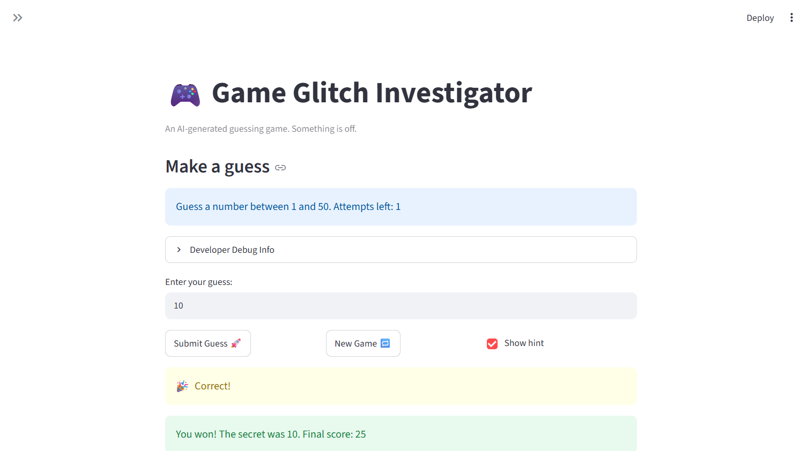

# 🎮 RAGuesser: The ~~Impossible~~ *Possible* Guesser!

RAGuesser is an adaptation of the classic number-guessing game with a twist: you can receive feedback from AI! Use the clues you receive to reach the right answer, and if you're ever stuck, you can receive help right there. It nudges you toward the right answer, gives you helpful feedback to improve your play, and teaches you interesting facts about algorithmic thinking and human psychology—all without spoiling the answer for you. The best part? After the game is finished, it shows the exact documents it used in full, so you can read them and learn for yourself.

## Architecture Overview

The `architecture.mmd` file in the `diagrams` subfolder contains a diagram explaining exactly how the RAG pipeline used for the AI feedback works. As the player makes guesses, the game state is updated with their history of guesses as well as basic information about the mode they are playing on. This is given to an initial LLM call which generates tailored keywords that can be used for the retrieval step.

The RAG pipeline is simple: it creates an inverted index of tokens matched to snippets of corresponding documents, then it matches tokens found in the keywords with those of the snippets. The selection process is modified so that multiple snippets from the same file are more likely to appear, since they will logically go well together even if they may not all have substantial scores.

The main LLM call is given a detailed prompt, details about the current game state, and the retrieved document snippets, in order to generate useful feedback that nudges the player in the right direction.

## 🛠️ Setup

1. Install dependencies: `pip install -r requirements.txt`
2. Place your Google Gemini API key in `.env` (`GEMINI_API_KEY=yourKeyHere`)
2. Run the app: `python -m streamlit run app.py`

## Sample Interactions

**Game 1: Normal Mode (Range 1-50, Secret Number 14, In Progress)**

> Hello! I am RAGuesser, your guide for this number-guessing game. You are currently playing on normal mode, meaning the valid range is from 1 to 50, and you are on guess number 3 out of 6.
> 
> Let's review your recent guess history and the clues you've gathered so far:
> Guess 1: 12 (Too low), Guess 2: 36 (Too high), Guess 3: 26 (Too high)
> 
> *(Output continues with evaluation and strategy tips...)* 
> 
> You have 3 guesses remaining. Take a breath, look at your active range (13–25), evaluate the midpoint, and make your next calculated move! Good luck!

**Game 2: Normal Mode (Range 1-50, Secret Number 14, Lost)**

> Hello! I am RAGuesser. Let's review your recent performance in the normal mode of the number-guessing game, where the secret number was 14 within the range of 1 to 50.
> 
> Unfortunately, you lost the game after 6 guesses.
> Guess 1: 12 (Too low), Guess 2: 36 (Too high), Guess 3: 26 (Too high), Guess 4: 22 (Too high), Guess 5: 19 (Too high), Guess 6: 13 (Too low)
> 
> *(Output continues with strategy analysis on binary search and the gambler's fallacy...)*
> 
> You were agonizingly close—your final guess of 13 was just one digit away from the secret number (14)! To improve next time, focus strictly on calculating the exact midpoint of your current high and low boundaries, ignoring gut feelings or past streaks.

## Design Decisions

I thought the idea of over-engineering a number-guessing game was kind of funny, but I was also able to turn it into a fun educational opportunity! I consider that a success.

Specifically, I chose to implement RAG into this game because while the optimal strategy is easy to execute once you understand it, not all people do, and even fewer people understand why it really works. Having specific documents that teach this information help guide the LLM toward forming the right responses for the job: through careful prompting, I was able to balance education with not making things too easy.

That being said, one place I would reconsider is the LLM pipeline. It uses one LLM call to generate the feedback, but another to generate the keywords! This can be seen as unnecessarily expensive and might cause people to reach usage limits faster than they expected for playing a game in which you guess a number. (I also didn't know how to switch models for different calls or if that would even change the limits.) But while something like making a basic algorithm to generate keywords would be cheaper, it would be very hard to make it read from the game state as well to tailor its output. 

## 📸 Demo Walkthrough

Describe your fixed game in numbered steps so a reader can follow along without watching a video:

1. User can select a difficulty using the sidebar at the left (say correct answer is 12)
2. User enters a guess of 25
3. Game returns "Too High"
4. User enters a guess of 10 → "Too Low"
5. User enters a guess of 15 → "Too High"
5. Score decreases by 5 after each incorrect guess
6. Game ends after the correct guess (win, earns a substantial amount of points) or after running out of attempts (lose)

**Screenshot** *(optional)*:


## 🧪 Test Results

```
# Paste your pytest output here, e.g.:
# pytest tests/
# 
# ========================================================================= test session starts =========================================================================
# platform linux -- Python 3.12.3, pytest-9.0.3, pluggy-1.6.0
# rootdir: /home/aabedin/CodePath/ai110-applied-ai-system-final
# plugins: anyio-4.13.0
# collected 107 items                                                                                                                                                   
# 
# tests/test_game_logic.py ....................................................                                                                                   [ 48%]
# tests/test_raguesser.py .......................................................                                                                                 [100%]
# 
# ========================================================================= 107 passed in 0.24s =========================================================================
```
The first suite of tests was simple to design and monitor since the game logic is simple; it's just guessing a number and receiving higher or lower. Testing the RAG was harder since I was less familiar with it and there were a lot more steps involved. I'm very happy that all the tests designed passed, but if I had more time it wouldn't hurt to do another sanity check and walk through the code again myself.

## Reflection

Overall, this project reminded me that a lot of the human aspect to building projects is still valuable. I probably spent more time designing the feature than I did implementing it, which I realize is going to become increasingly true as I move on throughout my career as a CS student. Still, I made sure to check the AI's output thoroughly because I wasn't always familiar with the libraries we were using (e.g. file I/O, Streamlit), so I often paused to make sure I understood what was going on.

## 🚀 Stretch Features

**Advanced RAG:**
The RAG system used for this project is a step up from the one we used for the initial tinker. First of all, it uses a variety of real documents sourced from real online articles, transcribed YouTube videos, and some generated by ChatGPT specifically for this game. These articles are tailored to touch on common concepts relating to this sort of game, including binary search (the optimal strategy for guessing), common alternatives to searching (like linear search or choosing randomly), gambler's fallacy (a fallacious way of thinking that can suboptimally influence people's guesses), and the supposed idea of inherently "random" numbers (37) and how humans decide randomness differently from computers.

Additionally, the current game state is heavily tied into the RAG pipeline at all steps. This means that the LLM can analyze the player's current status and guessing habits and suggest a tailored course of action. I initially didn't include the game state in the keyword-generation LLM, but I realized that this might make most generations the same instead of adapting to the user.
